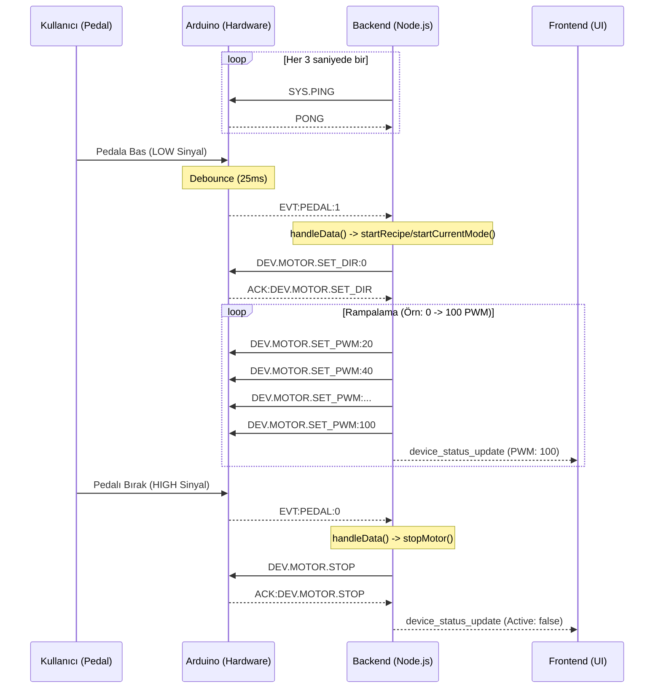

# FUE Motor Sistemi Seri İletişim Protokolü (Serial Communication Protocol)

Bu doküman, FUE Saç Ekimi Mikromotor sisteminin Backend (Raspberry Pi / Node.js) ile Donanım (Arduino / Firmware v4.1) arasındaki seri iletişim protokolünü detaylandırmaktadır.

## 1. Bağlantı Katmanı (Physical & Connection Layer)

Sistem, USB veya UART arayüzü üzerinden asenkron seri haberleşme kullanır.

*   **Arayüz:** UART / USB Serial
*   **Baud Rate:** `115200` bps
*   **Data Bits:** 8
*   **Parity:** None (Yok)
*   **Stop Bits:** 1
*   **Flow Control:** None
*   **Voltaj Seviyesi:** Arduino modeline göre 5V veya 3.3V (Raspberry Pi GPIO kullanılıyorsa seviye dönüştürücü gerekebilir, USB üzerinden ise doğrudan uyumludur).
*   **Backend Kütüphanesi:** Node.js `serialport` paketi ve `@serialport/parser-readline`.
*   **Firmware Kütüphanesi:** Arduino Standart `Serial` kütüphanesi.

**Kod Referansları:**
*   **Backend:** `packages/backend/src/config.ts` (Ayar: `baudRate: 115200`), `packages/backend/src/services/arduinoService.ts` (`SerialPort` başlatma).
*   **Arduino:** `FUE_Slave_v4_1.ino` -> `setup()` -> `Serial.begin(115200);`.

## 2. Veri Paket Yapısı (Data Structure)

İletişim, insan tarafından okunabilir (human-readable) ASCII karakter tabanlı bir protokol üzerine kuruludur.

*   **Format:** String (ASCII)
*   **Satır Sonlandırıcı (Delimiter):** Newline karakteri (`\n` veya ASCII 10).
*   **Komut Yapısı:** `GRUP.KOMUT:PARAMETRELER`
    *   `GRUP`: Komut grubu (Örn: `SYS`, `DEV`, `PIN`).
    *   `KOMUT`: İşlem adı (Örn: `PING`, `SET_PWM`).
    *   `PARAMETRELER`: Opsiyoneldir. Varsa `:` ile ayrılır. Birden fazla parametre varsa `|` ile ayrılır (Örn: `200|50`).

### Örnek Paketler

| Yön | Paket İçeriği | Anlamı |
| :--- | :--- | :--- |
| **Backend -> Arduino** | `DEV.MOTOR.SET_PWM:150\n` | Motor PWM hızını 150 yap. |
| **Backend -> Arduino** | `SYS.PING\n` | Bağlantı kontrolü (Ping). |
| **Arduino -> Backend** | `ACK:DEV.MOTOR.SET_PWM\r\n` | Komut alındı ve işlendi onayı. |
| **Arduino -> Backend** | `EVT:PEDAL:1\r\n` | Pedal basıldı olayı. |

## 3. Komut Seti (Backend -> Arduino)

Aşağıdaki komutlar Backend tarafından Donanıma gönderilir.

| Komut Kodu | Parametreler | Açıklama | Kod Referansı (Arduino) |
| :--- | :--- | :--- | :--- |
| `SYS.PING` | Yok | Bağlantı testi. Arduino `PONG` yanıtı döner. | `processCommand` -> `SYS.PING` |
| `SYS.INFO` | Yok | Firmware adı ve versiyonunu döner. | `processCommand` -> `SYS.INFO` |
| `SYS.RESET` | Yok | Arduino'yu yazılımsal olarak yeniden başlatır. | `processCommand` -> `SYS.RESET` |
| `DEV.MOTOR.SET_PWM` | `0-255` (PWM) | Motor hızını ayarlar. | `processCommand` -> `DEV.MOTOR.SET_PWM` |
| `DEV.MOTOR.SET_DIR` | `0` (CW), `1` (CCW) | Motor dönüş yönünü ayarlar. | `processCommand` -> `DEV.MOTOR.SET_DIR` |
| `DEV.MOTOR.STOP` | Yok | Motoru durdurur (Hızı 0 yapar, zamanlı görevleri iptal eder). | `processCommand` -> `DEV.MOTOR.STOP` |
| `DEV.MOTOR.EXEC_TIMED_RUN` | `PWM|SÜRE` (ms) | Motoru belirli bir hızda, belirli bir süre çalıştırır. | `processCommand` -> `DEV.MOTOR.EXEC_TIMED_RUN` |
| `DEV.MOTOR.BRAKE` | Yok | Motoru kısa süreli (25ms) frenler (Bobinleri kilitler). | `processCommand` -> `DEV.MOTOR.BRAKE` |
| `DEV.BUZZER.BEEP` | `SÜRE|FREKANS` | Belirtilen frekansta ve sürede sesli uyarı verir. | `processCommand` -> `DEV.BUZZER.BEEP` |
| `PIN.SET_MODE` | `PIN:MOD` | Belirtilen pinin modunu ayarlar (0:INPUT, 1:OUTPUT, 2:PULLUP). | `processCommand` -> `PIN.SET_MODE` |
| `PIN.SET_D` | `PIN:DEĞER` | Dijital pine yazar (0 veya 1). | `processCommand` -> `PIN.SET_D` |
| `PIN.GET_D` | `PIN` | Dijital pini okur. `DATA:PIN_D:PIN:VAL` döner. | `processCommand` -> `PIN.GET_D` |
| `PIN.SET_A` | `PIN:DEĞER` | Analog (PWM) pine yazar. | `processCommand` -> `PIN.SET_A` |
| `PIN.GET_A` | `PIN` | Analog pini okur. `DATA:PIN_A:PIN:VAL` döner. | `processCommand` -> `PIN.GET_A` |

## 4. Telemetri ve Yanıtlar (Arduino -> Backend)

Donanımdan Backend'e gönderilen veriler olay tabanlıdır (Event-driven) veya komutlara verilen yanıtlardır.

| Veri Tipi | Format | Gönderim Sıklığı / Tetikleyici | Açıklama |
| :--- | :--- | :--- | :--- |
| **Bağlantı Yanıtı** | `PONG` | `SYS.PING` komutuna cevaben. | Backend bağlantıyı canlı tutmak için periyodik gönderir. |
| **Bilgi** | `INFO:AD:VER` | `SYS.INFO` komutuna cevaben. | Firmware adı ve versiyon bilgisi. |
| **Komut Onayı** | `ACK:KOMUT_ADI` | Geçerli bir komut işlendiğinde. | Komutun başarıyla alındığını teyit eder. |
| **İşlem Tamamlandı** | `DONE:KOMUT_ADI` | Zamanlı işlem bittiğinde. | `EXEC_TIMED_RUN` süresi dolduğunda gönderilir. |
| **Hata** | `ERR:HATA_KODU` | Geçersiz komut alındığında. | Genellikle `ERR:INVALID_CMD`. |
| **Pedal Olayı** | `EVT:PEDAL:1` veya `0` | Durum değiştiğinde (Debounce: 25ms). | 1: Basıldı (Aktif), 0: Bırakıldı (Pasif). |
| **Anahtar Olayı** | `EVT:FTSW:1` veya `0` | Durum değiştiğinde (Debounce: 25ms). | El/Ayak modu anahtarı değişimi. |
| **Pin Verisi** | `DATA:PIN_X:P:V` | `PIN.GET` komutuna cevaben. | İstenen pinin okunan değeri. |

## 5. Durum Yönetimi ve Akış (State Machine & Sequence)

### Handshake (El Sıkışma)
Sistem açıldığında Backend otomatik olarak `SYS.PING` gönderir. Arduino `PONG` yanıtı verdiğinde bağlantı "Connected" olarak işaretlenir ve arayüze bildirilir.

### Çalışma Senaryosu (Sequence Diagram)
Aşağıdaki diyagram, kullanıcının pedala basarak motoru "Sürekli Mod"da çalıştırması senaryosunu gösterir:

## 6. Hata Kodları ve Yönetimi

Arduino tarafında gelişmiş bir hata yönetim mekanizması bulunmamaktadır, ancak temel protokol hataları bildirilir.

*   **`ERR:INVALID_CMD`**: Tanımlı olmayan bir komut dizisi gönderildiğinde döner. Backend bu yanıtı loglar ancak kullanıcıya doğrudan yansıtmaz.
*   **Bağlantı Kopması:** Backend, `serialport` kütüphanesinin `close` veya `error` olaylarını dinler. Bağlantı koptuğunda:
    1.  UI'a `arduino_disconnected` olayı gönderilir.
    2.  Otomatik yeniden bağlanma mekanizması (`connectToArduino`) devreye girer ve konfigürasyondaki süre kadar bekleyip tekrar dener.

### Güvenlik ve Gecikme Önlemleri
1.  **Non-Blocking Loop:** Arduino kodu `delay()` fonksiyonunu (Brake ve Debounce hariç) kullanmaz. `millis()` tabanlı zamanlayıcılar ile motor sürülürken aynı anda sensörler okunabilir.
2.  **Safety Stop:** `setup()` fonksiyonunda ve `STOP` komutunda motor PWM'i 0'a çekilir ve yön pinleri güvenli moda alınır.
3.  **Watchdog (Backend):** Backend tarafında `pingInterval` ile bağlantı sağlığı sürekli izlenir.
4.  **Debounce:** Pedal ve anahtar girişleri, gürültüden kaynaklı hatalı tetiklemeleri önlemek için 25ms'lik yazılımsal filtrelemeye (debounce) sahiptir.
