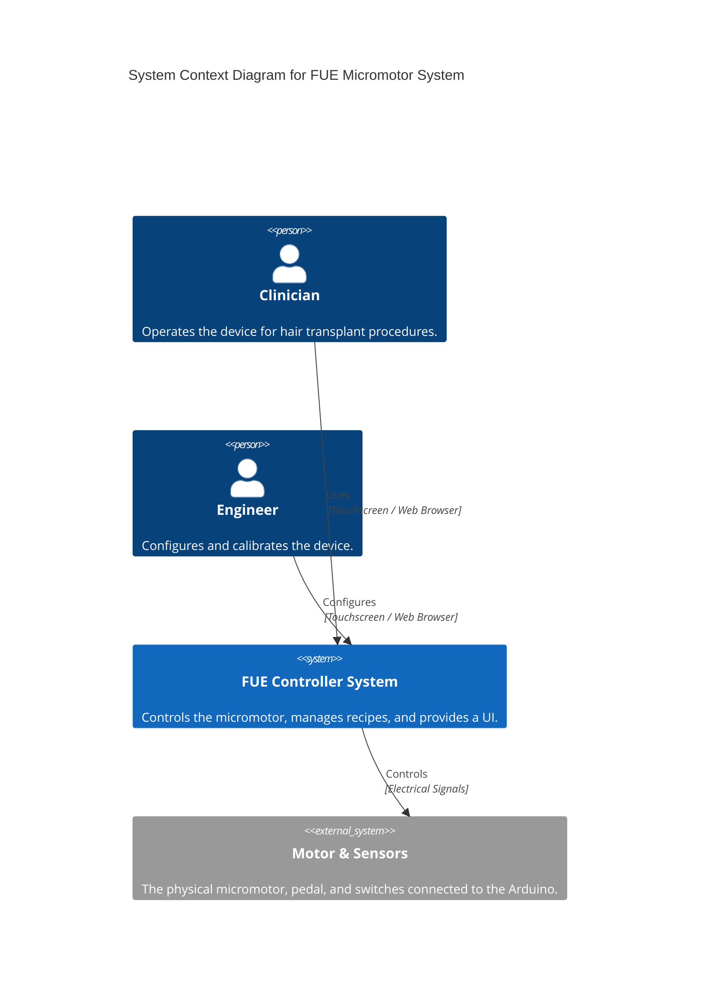
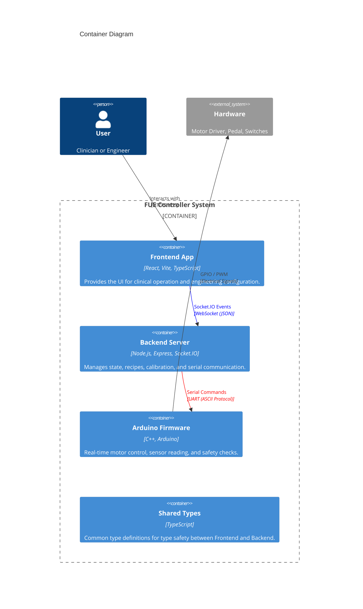
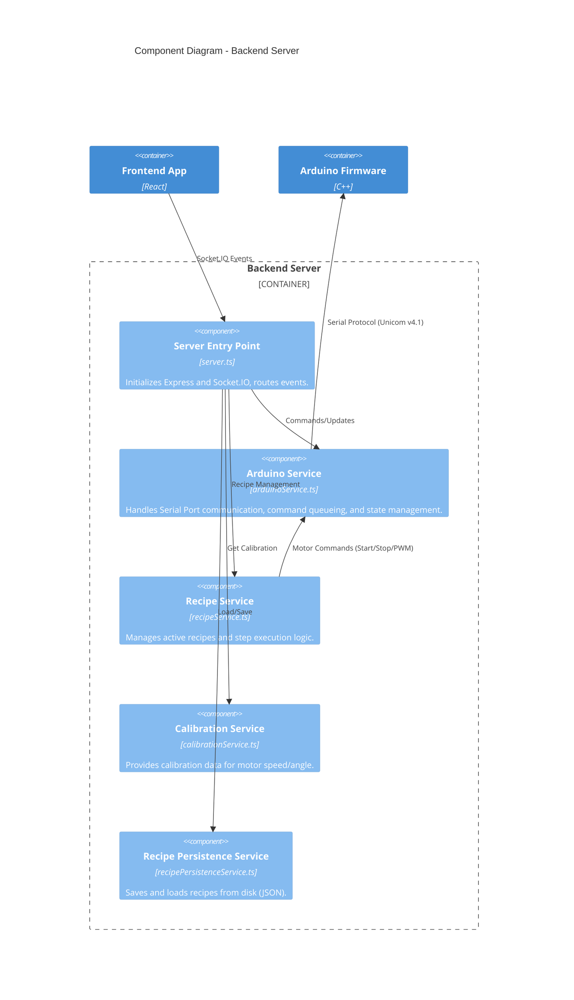

# Architecture

This document describes the high-level architecture of the FUE Hair Transplant Micromotor System.

## System Context (C4 Level 1)

The system consists of a User (Clinician or Engineer) interacting with a single-page web application (Frontend), which communicates with a Backend server. The Backend controls the Hardware (Arduino Micromotor Controller) via a serial connection.

## Container Diagram (C4 Level 2)

The system is deployed as a monorepo with three main containers: Frontend, Backend, and Firmware.

## Component Diagram (C4 Level 3) - Backend

The Backend is the central coordinator.

## Data Flow Summary

1.  **User Input:** The user selects a mode or recipe on the Frontend.
2.  **Socket Event:** The Frontend emits a Socket.IO event (e.g., `start_motor`, `recipe_start`) to the Backend.
3.  **Service Logic:** The `server.ts` routes the event to the appropriate service (e.g., `RecipeService` or `ArduinoService`).
4.  **Hardware Command:** The service generates a command string (e.g., `DEV.MOTOR.SET_PWM:150`) and sends it via `ArduinoService`.
5.  **Serial Transmission:** The `ArduinoService` writes the command to the Serial Port.
6.  **Firmware Action:** The Arduino receives the command, parses it, and updates the motor PWM or direction.
7.  **Feedback:** The Arduino sends an acknowledgement (`ACK`) or event (`EVT`) back to the Backend.
8.  **UI Update:** The Backend processes the response and emits a `device_status_update` event to the Frontend.
