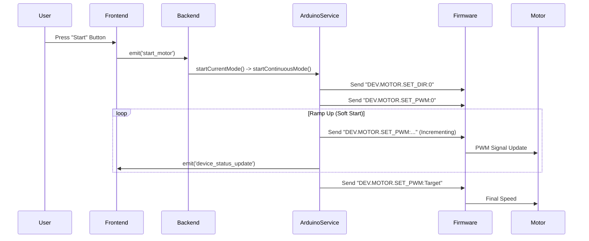
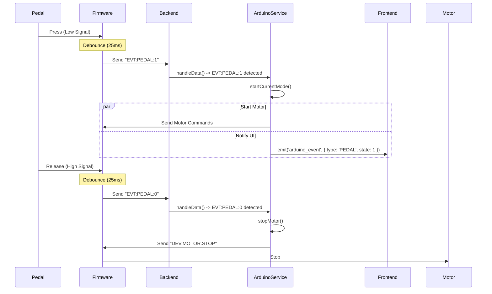
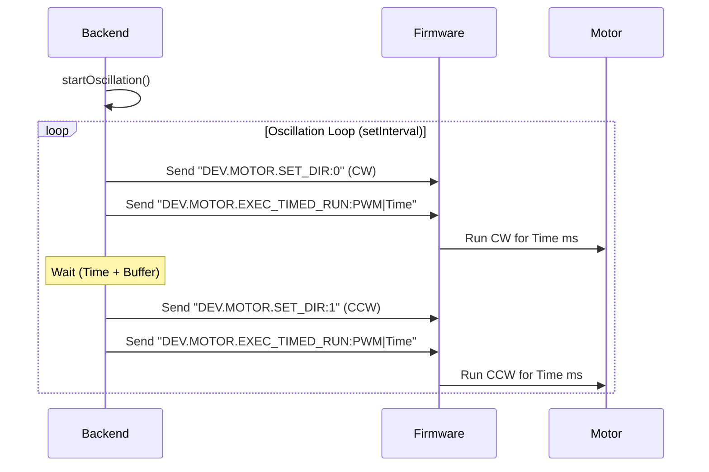
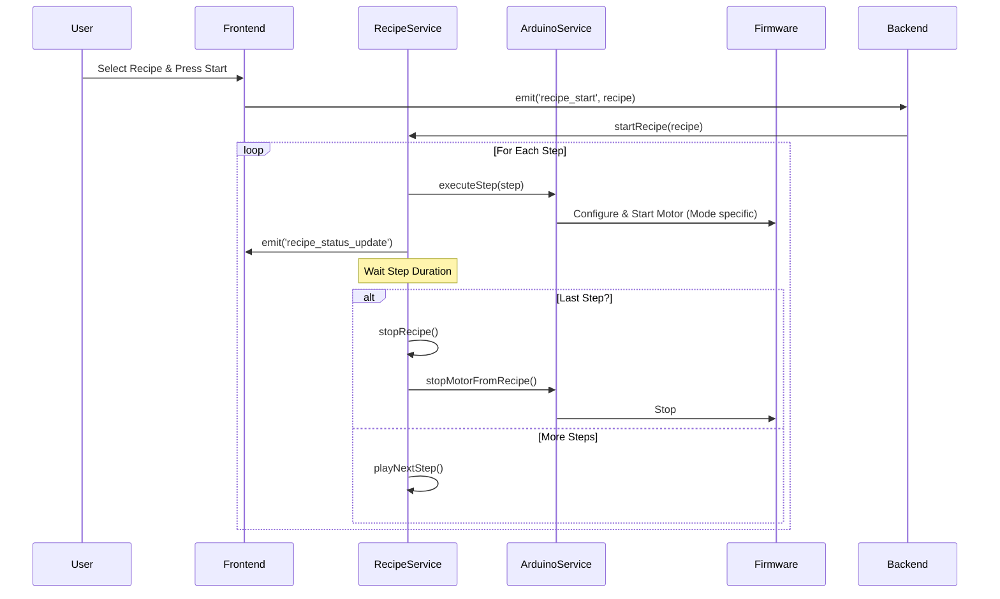
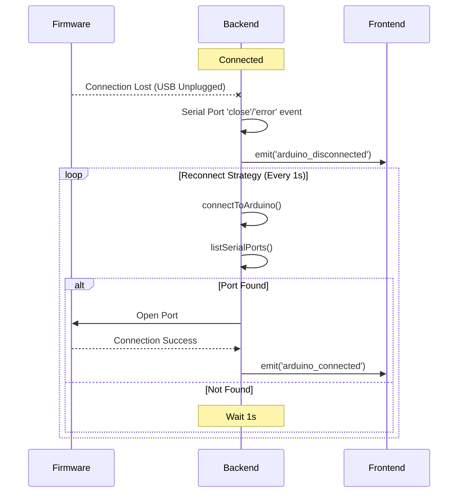

# System Flows

This document details the critical runtime sequences of the FUE Micromotor System.

## 1. Manual Motor Control (Continuous Mode)

The user manually starts the motor via the UI or Pedal in Continuous Mode.

## 2. Pedal Interaction

The user controls the motor using the foot pedal.

## 3. Oscillation Mode Execution

The motor oscillates back and forth (CW/CCW) based on backend timing.

## 4. Recipe Execution

The system executes a predefined sequence of steps.

## 5. Connection Recovery

Handling USB disconnection and reconnection.

