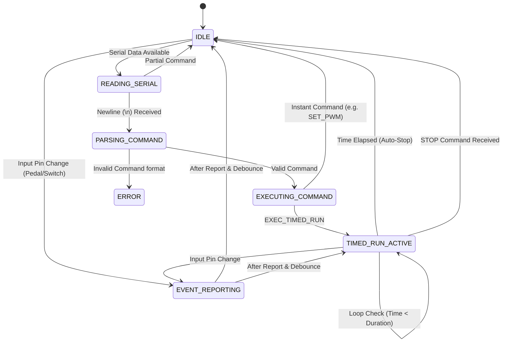

# Arduino Firmware Deep Dive: FUE_Slave_v4_1

This document provides a detailed technical analysis of the `FUE_Slave_v4_1` firmware. It is intended for developers who need to understand the internal mechanics, state management, and timing constraints of the microcontroller code.

**Firmware Source:** `packages/arduino_firmware/FUE_Slave_v4_1/FUE_Slave_v4_1.ino`

## 1. State Machine

The firmware operates on a non-blocking loop architecture. While it doesn't use a formal `switch-case` state machine, the logical flow can be represented as follows:

**Key State Variables:**
- `commandReady` (bool): Triggers `processCommand`.
- `timedRunActive` (bool): Indicates if the motor is in a timed execution sequence.
- `lastPedalState`, `lastFtswState` (int): Track input states for event detection.

## 2. Message Handling & Error Cases

The firmware processes commands in `processCommand(String& cmd)`. Commands are expected to be newline-terminated strings.

### Parsing Logic
- **Buffer:** `inputString` accumulates characters in `serialEvent()`.
- **Delimiter:** Commands are split by the first colon (`:`) into `fullCommand` and `params`.
- **Reference:** `processCommand` function in `FUE_Slave_v4_1.ino`.

### Command Structure
Format: `GROUP.COMMAND:PARAM` (e.g., `DEV.MOTOR.SET_PWM:150`)

| Command Group | Prefix | Description | Example |
| :--- | :--- | :--- | :--- |
| **System** | `SYS.` | Metadata & Reset | `SYS.INFO` |
| **Device** | `DEV.` | Hardware Control (Motor, Buzzer) | `DEV.MOTOR.SET_PWM` |
| **Pin** | `PIN.` | Raw GPIO Access | `PIN.SET_D` |

### Error Cases
If a command string does not match any known `fullCommand`, the firmware responds with:
`ERR:INVALID_CMD`

**Reference:** `else` block at the end of `processCommand`.

## 3. Timing & Interrupt Assumptions

The firmware is designed to be **non-blocking** to ensure the motor can be controlled while simultaneously monitoring inputs.

### The `millis()` Loop
- The `loop()` function runs continuously.
- **Timed Runs:** `handleTimedRun()` checks `millis() - timedRunStartTime >= timedRunDuration` on every iteration. This allows the motor to run for a specific duration without blocking serial communication or input monitoring.
- **Reference:** `handleTimedRun()` in `FUE_Slave_v4_1.ino`.

### Blocking Delays (Exceptions)
There are specific instances where `delay()` is used, blocking the loop briefly:
1.  **Debouncing:** `handleInputEvents()` uses `delay(25)` to filter noise on `PEDAL_PIN` and `FTSW_PIN`.
2.  **Braking:** `DEV.MOTOR.BRAKE` uses `delay(25)` to apply a short reverse/brake pulse.

**Assumption:** A 25ms delay is considered negligible for user interaction and motor responsiveness in this specific application context.

### Interrupts
- **Serial:** Uses the hardware UART interrupt (handled by Arduino core's `Serial` library) to buffer incoming data. `serialEvent()` is called at the end of `loop()` if data is available.

## 4. Calibration Workflow

The firmware is an **actuator**, not a calculator. It does not store or process "RPM" or "Angle" logic.

- **Backend Role:** The backend (`packages/backend/src/services/calibrationService.ts`) holds the look-up tables (`RPM_CALIBRATION_MARKS`, `calibrationTable`) that map a desired User RPM/Angle to a specific PWM value (0-255) and Duration (ms).
- **Firmware Role:** The firmware faithfully executes the provided `PWM` and `Duration`.
- **Workflow:**
    1.  User selects "1750 RPM, 270°" in UI.
    2.  Backend looks up: `1750 RPM -> PWM 42`, `270° @ Speed Index 8 -> 83ms`.
    3.  Backend sends: `DEV.MOTOR.EXEC_TIMED_RUN:42|83`.
    4.  Firmware executes: Motor ON at PWM 42 for 83ms.

**Reference:** `packages/backend/src/services/calibrationService.ts` (Backend), `DEV.MOTOR.EXEC_TIMED_RUN` in `FUE_Slave_v4_1.ino` (Firmware).

## 5. Safety Limits & Default Behaviors

### Initialization (`setup()`)
- **Motor:** `PWM` is set to 0. Direction pins are `LOW`.
- **Inputs:** `PEDAL_PIN` and `FTSW_PIN` are configured as `INPUT_PULLUP` (Default HIGH, Active LOW) to prevent floating inputs.
- **Reference:** `setup()` in `FUE_Slave_v4_1.ino`.

### Emergency Stop
- **Command:** `DEV.MOTOR.STOP`
- **Behavior:** Immediately sets `MOTOR_PWM_PIN` to 0 and sets `timedRunActive = false`. This overrides any ongoing timed operation.
- **Reference:** `DEV.MOTOR.STOP` block in `processCommand`.

### Input Safety
- **Pull-ups:** Internal pull-up resistors ensure that if a wire breaks (open circuit), the input reads HIGH (inactive state for active-low switches), preventing accidental activation.
